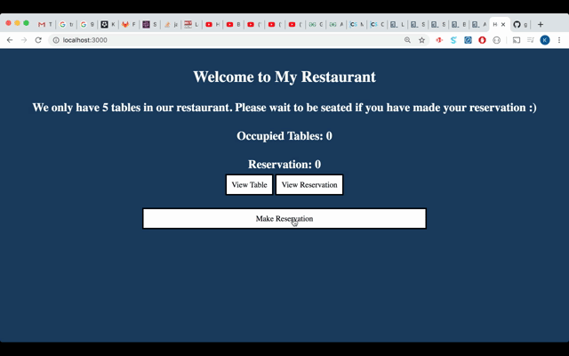

# Restaurant Reservation Application

A simple back-end web application for table reservation at a restaurant

## Project Description

The restaurant manager can reserve a table for users by making reservations. 

Once five tables are occupied (reserved), any additional reservations made will be added to Reservation (a.k.a waitlist)

Once the user finishes using a table, the admin can go to "view table" and remove it from the occupied table list. 

The first reservation on the reservation/waitlist will be automatically added to the occupied table list

## Demo

Test the app -> [Demo](https://gh0stl0nely-restaurant-reservation-web-app.glitch.me/)

## GIF demonstration 

## Built With

* [HTML](https://developer.mozilla.org/en-US/docs/Web/HTML) - Used for template layout
* [CSS](https://www.w3.org/Style/CSS/Overview.en.html) - Used for template styling
* [Materialize](https://materializecss.com/) - CSS Library
* [NodeJS](https://nodejs.org/en/) - Javascript runtime environment for this CLI application
* [Express](https://expressjs.com/) - NodeJS framework for receiving and sending request with the front end
* [NPM](https://www.npmjs.com/) - A tool for dependency management 
* [EJS](https://ejs.co/) - Templating engine
* [jQuery](https://jquery.com/) - Javascript framework for DOM manipulation

## News things that I learned

* Express Middleware
* GET/POST/DELETE Requests in Express
* Routing and Server
* Writing RESTful API

## Author

* [Khoi Nguyen](https://github.com/gh0stl0nely)
